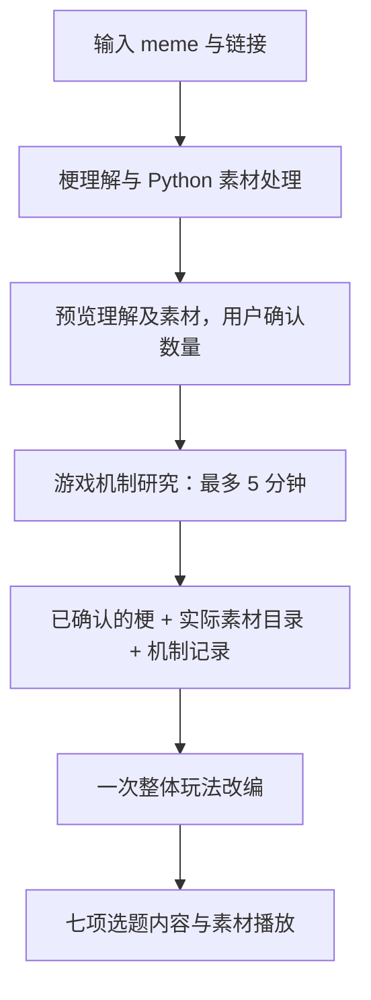

# Meme Studio 本地工作台

访问 **http://127.0.0.1:4317**。macOS 双击 `start.command` 启动并打开页面，双击 `stop.command` 停止。关闭网页不会中断研究；停止服务会取消执行中的 CLI。重启后可在历史记录中重试。

## 两步使用

1. 输入 meme 名称、链接或版本说明。Agent 研究“素材到底哪一下有意思？依据是什么？”以及“要保住这个趣味，哪些东西不能随便改？”，自行核验并保留证据缺口。
2. 用户确认版本并指定 **1–50 个选题**。依次运行游戏机制研究和一次整体玩法改编，结果展示一句话玩法、必要规则、玩家操控方式、素材使用、梗的趣味、最小实现、参考。



全站共享 **3 个 CLI 名额**。同一任务研究后再改编，不同任务共享队列。CLI 内部子代理关闭，不修改用户全局配置。取消旧三路展开、独立审核和按审核状态过滤结果；后端只检查格式、编号、必要内容及引用关系。

## Skill 版本

当前 `workflowVersion: 3`，Skill `meme-studio-v3.0.0`。每个任务复制 `vendor/skills` 并记录 `vendor/manifest.json` 的文件摘要；阶段工作目录只装载对应 Skill：

| 阶段 | Skill | 输入 → 输出 |
| --- | --- | --- |
| 梗理解 | meme-asset-extract | 输入/纠正 → 梗分支、依据、不能改的要素、素材 |
| 机制研究 | game-mechanism-research | 已确认梗与素材 → 具体机制、依据、相关性、缺口 |
| 玩法改编 | meme-mechanism-adaptation | 完整确认信息、素材、研究、数量 → 七项选题 |

素材 Python 脚本、依赖和配置保持原样，源自上游 `meme-asset-extract` 的 `7171f679`。当前梗理解前两问原文保存在素材 Skill 的 `references/meme-understanding.md`。旧 `meme-mechanism-concept`、`steam-mechanism-match` 不再装载；游戏元数据脚本迁入研究 Skill。

历史 v1/v2 记录不转换、不改写，继续使用旧展示及导出。点击“使用同一素材新建研究”会以原始输入和链接建立 v3 任务。

## 5 分钟研究预算

从 CLI 子进程实际启动计时，排队与准备目录不计入。研究提示要求预留 45 秒收尾，每完成一条机制原子写入 `research-checkpoint.json`。300 秒时停止研究进程组及子进程；不追加总结调用。超时仅使用本次尝试已保存且结构、引用有效的记录，页面明确标记；无有效记录则停止，允许重试。

研究正常结果优先。每梗最多 12 条查询是 **Skill 指令，不是工具拦截额度**；实际查询从 CLI JSONL 提取，单独记录在 `searches.json`。未实现独立费用硬上限。

改编失败后重试复用同一修订的已完成研究及素材；修改梗理解会使旧研究失效。研究和改编都不使用旧淘汰规则决定是否显示。

## 安装与运行

仓库仅包含源码与 Skill，不含依赖环境、媒体二进制和用户研究记录。按下述步骤在本机安装；FFmpeg / ffprobe 请安装适合当前平台的版本并加入 PATH。

新环境需要 Node.js 22+、已登录的 Codex CLI。优先 Python 3.10+，并安装 FFmpeg / ffprobe：

```sh
npm ci
codex login
python3 -m venv .venv
.venv/bin/python -m pip install -r vendor/skills/meme-asset-extract/requirements.txt
.venv/bin/python -m playwright install chromium
node scripts/local-server.mjs start
```

也可在终端用 `npm start` 前台运行。`start.command` 和后台启动器自动查找本机 Codex App 内的 CLI、`.venv/bin/python` 及 `runtime/bin`。前台启动时请让相应工具在 PATH 中，或设置 `CODEX_BIN` / `MEME_PYTHON`。

| 变量 | 用途 |
| --- | --- |
| `PORT` | 本地端口，默认 4317 |
| `CODEX_BIN` | 指定 Codex CLI 文件 |
| `MEME_PYTHON` | 供媒体脚本使用的 Python 绝对路径 |
| `CODEX_MODEL` | 可选覆盖模型；不设置则沿用本地 Codex 配置 |

调用通过本机 `codex exec` 进行，沿用登录账号和模型额度；不是离线模型。页面不需要填写 OpenAI API Key。非交互调用使用 JSON Schema、JSONL 进度流和输出文件，见 [Codex 非交互运行文档](https://developers.openai.com/codex/noninteractive/)。

素材 Skill 的 Gemini 音视频理解是独立可选能力，沿用该 Skill 已配置的方式；本网页不保存或索取密钥。如果不可用，任务仍可进行公开来源研究，但会保留未实听/实看的缺口。Playwright、FFmpeg 安装成功也不保证所有站点可访问。

## 数据和执行边界

- 服务仅绑定 `127.0.0.1`，校验 Host、Origin 和写入请求的页面令牌。
- `data/<研究ID>/run.json` 保存状态、确认版本、来源、结果和简要进度。
- `data/<研究ID>/work/<任务ID>/` 保存本阶段的提示词、Skill、结构化输出、素材及 CLI 日志。JSON 导出包含完整研究数据；Markdown 适合阅读。
- CLI 使用 `workspace-write`、无需审批的非交互模式，并为公开资料检索启用网络；关联的个人 MCP 服务在本次调用中关闭。用户材料通过标准输入传递，不拼成 shell 命令。
- 页面上的来源和模型输出按纯文本渲染。素材仅允许从本次研究目录读取；拒绝路径穿越和逃出目录的软链接。
- 研究阶段上限 300 秒；梗理解和改编沿用 30 分钟运行保护，不占研究预算。取消停止进程组并移除排队任务。
- `assets` 用任务内唯一 ID 关联阶段、相对文件路径、媒体类型、来源及已知时间区间；保留原 Python manifest、提取计划、观察记录。`/media?assetId=...` 支持音视频 Range 请求，历史 `/media?path=...` 继续可用。待补或不使用素材不产生播放器。

## 验证与维护

```sh
npm test
node scripts/local-server.mjs stop
```

自动测试覆盖确认门槛、过期版本、数量及编号、同修订研究复用与全站并发 3、错误输出、失败重试、取消和重启恢复、HTTP 边界、导出及素材访问。

`scripts/smoke.mjs` 是需要手动运行的真实 CLI 端到端验收，会消耗账号额度，并由验收程序明确确认厉飞雨、广东人吃福建人后各生成 1 个选题。测试数据默认写入独立 `data-smoke`，不会作为用户研究自动出现在网页中。运行方式：

```sh
CODEX_BIN=/Applications/ChatGPT.app/Contents/Resources/codex \
MEME_PYTHON="$PWD/.venv/bin/python" \
PATH="$PWD/runtime/bin:$PATH" \
node scripts/smoke.mjs
```

运行日志位于 `logs/server.log`；应用不随系统登录自动启动，也没有部署到公网。

## 更新与回退

完成自动测试及真实链路验证后提交到本仓库 main。先通过 `/api/meta` 检查 active/queued 均为 0，再停止并启动本地服务。`/api/meta` 和网页页脚提供 Skill 版本及实际启动时 Git commit，用于与 GitHub 核对。

运行回归时停止服务、恢复上一提交的代码再启动；不要删除或迁移 `data`。旧代码不能解释 v3 结果时，保留记录等待恢复新版读取。测试记录在 `data-smoke`，不进入用户历史。
